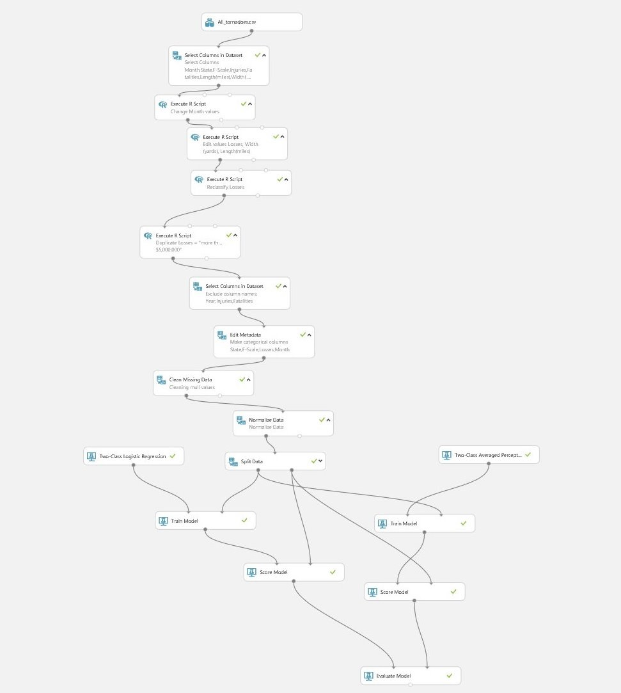
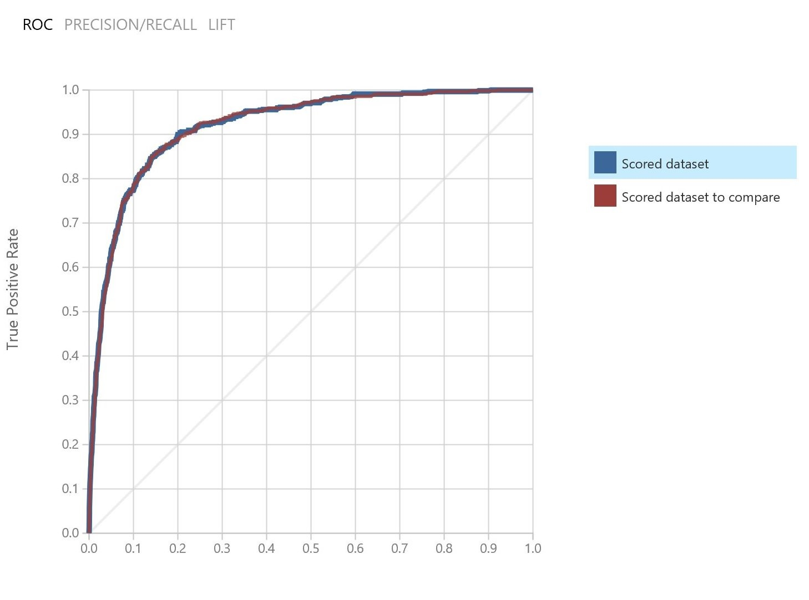
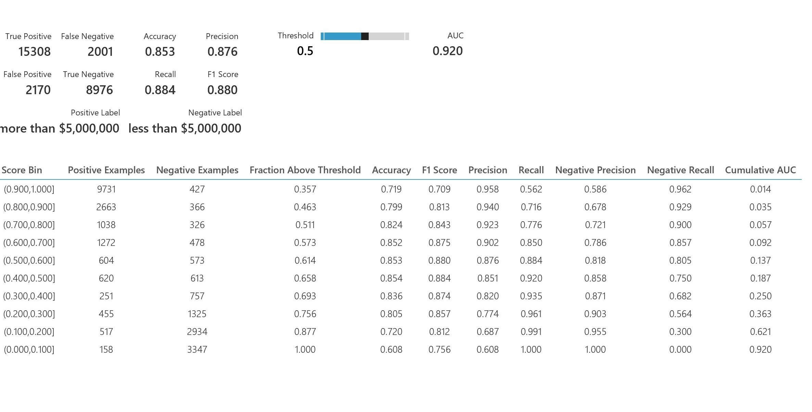
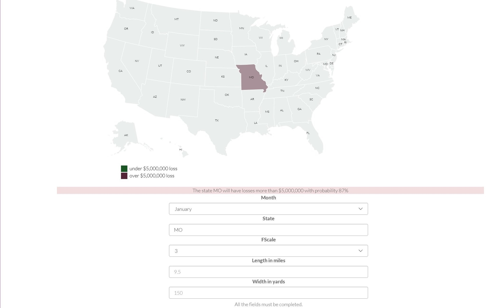
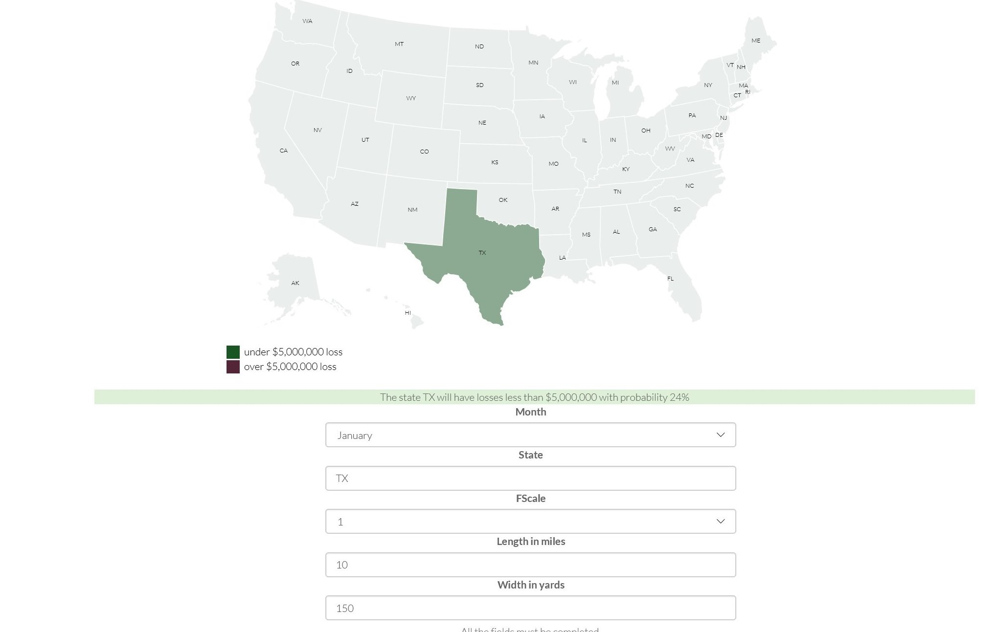

# Tornadoes-loss

Tornadoes-loss is a predictive service for calculating the loss in US dollars from a tornado. 

*Demo Site*

[http://tornadoes.azurewebsites.net/](http://tornadoes.azurewebsites.net/)

## Introduction

This is a Machine Learning experiment, which implements Predictive Analytic service in GIS projects using Azure Machine Learning.

## Data

The data have being downloaded from NOAA's National Weather Service [Storm prediction center](http://www.spc.noaa.gov/wcm/#jmc) .

The csv with the data of the tornadoes from 1950-2016 can be found [here](data/All_tornadoes_with_headers.csv)

## Azure Machine Learning

The data have being uploaded, filtered and analyzed so they would be ready for training the model.

For this procedure was used the `Azure Machine Learning` platform ([link](studio.azureml.net/)) 

In the figure below shows the whole procedure for training and eveluating the model.

There have being used many Machine Learning Algorithms, but it end up in two:

1. Two-Class Logistic Regression 
2. Two-Class Averaged Perceptron 

The Roc Curve is over the random guess 

The evaluation of the two training model are shown below 

 *Notice, that the accuracy was around 85% and the precision 87%.*

The experiment is published in the Cortana Analytics Gallery and can be found in the above link:

[Tornadoes cost experiment](https://gallery.cortanaintelligence.com/Experiment/Tornadoes-cost-experiment-1)

## Web Service

Then it was published as a service using the Azure Machine Learning Platform and the end point returned as a Swagger API endpoint.

## Web Application

Last, but not least, it has being developed a ASP.NET Core application which:

1. Serves static html content
2. Exposes a Web API.

The web application can be found here:

[http://tornadoes.azurewebsites.net/](http://tornadoes.azurewebsites.net/)

## GIS development

For the need of the projected it was used JS libraries like D3.js, which creates very quickly svg inteactive maps.

## Prediction Analytic Service Test

Below, are shown two examples with results:
1. tornado loss more than $5,000,000.
2. tornado loss less than $5,000,000.

### Example 1

 

### Example 2

## License

The whole project is under the MIT License

For more details please, check out the folder [docs](/docs)
