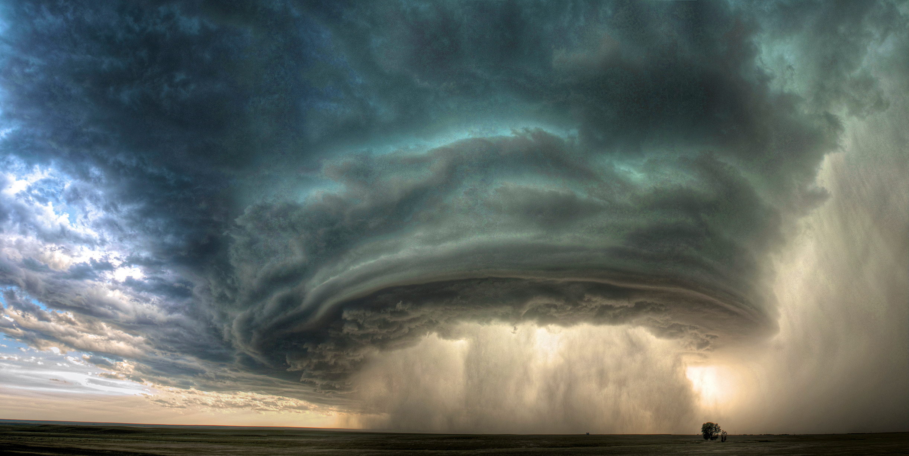

# Tornadoes-loss

Tornadoes-loss is a predictive service for calculating the loss in US dollars from a tornado. 

[http://tornadoes.azurewebsites.net/](http://tornadoes.azurewebsites.net/)

## Introduction

This is a Machine Learning experiment, which implements Predictive Analytic service in GIS projects using Azure Machine Learning.

## Data

The data have being downloaded from NOAA's National Weather Service [Storm prediction center](http://www.spc.noaa.gov/wcm/#jmc) .

## Azure Machine Learning

The data have being uploaded, filtered and analyzed so they would be ready for training the model.

There have being used many Machine Learning Algorithms, but it end up in two:

1. Two-Class Logistic Regression 
2. Two-Class Averaged Perceptron 

The experiment can be found in the above link:

[Tornadoes cost experiment](https://gallery.cortanaintelligence.com/Experiment/Tornadoes-cost-experiment-1)

## Web Service

Then it was published as a service using the Azure Machine Learning Platform and the end point returned as a Swagger API endpoint.

## Web Application

Last, but not least, it has being developed a ASP.NET Core application which:

1. Serves static html content
2. Exposes a Web API.

The web application can be found here:

[http://tornadoes.azurewebsites.net/](http://tornadoes.azurewebsites.net/)

## GIS development

For the need of the projected it was used JS libraries like D3.js, which creates very quickly svg inteactive maps.

## License

The whole project is under the MIT License

For more details please, check out the folder [docs](/docs)
